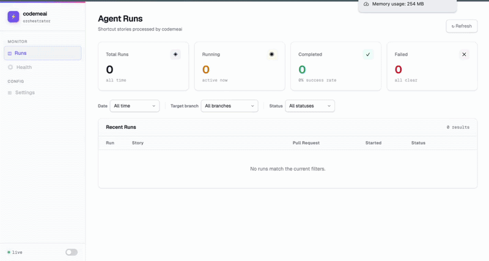
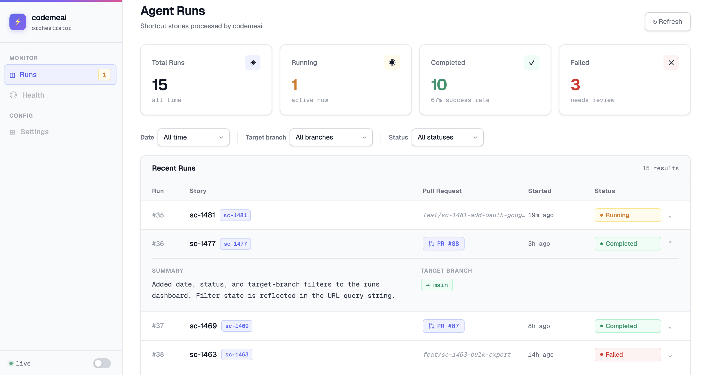
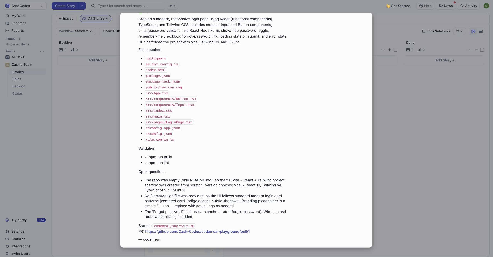

# AI Code Orchestrator (codemeai)

An autonomous coding agent that listens to your Shortcut project board and implements stories for you. Tag any story with `@codemeai`, save it and a Claude Code agent opens a pull request with working, validated code - build passing, lint clean.

[](https://github.com/Cash-Codes/AI_codeme_orchestrator/actions/workflows/ci.yml)


[](#)
[](#)
[](#)
[](#)
[](#)
[](#)
[](#)

## 🌐 Live Demo

🔗 https://codemeai-orchestrator-47379510695.europe-west2.run.app

## 🎥 Demo



## Live Flow

```
Shortcut story tagged @codemeai
  → webhook → Express server
    → isolated git worktree
      → Claude Code CLI implements the ticket
        → build + lint validation
          → PR opened on GitHub
            → comment posted back to Shortcut
```

## ✨ Features

- Tag any Shortcut story with `@codemeai` to trigger implementation
- Claude Code agent works inside an isolated git worktree, your main branch is never touched
- Runs build and lint commands to validate changes before pushing
- Opens a GitHub PR with a generated title and description
- Posts a structured completion comment back to the Shortcut story
- Real-time dashboard to monitor all runs (status, PR link, summary)
- Demo mode with fixture data, fully usable without real credentials

## 🖼️ Screenshots




## 🧠 Tech Stack

**Backend**

| Technology | Version | Role |
|---|---|---|
| Node.js | 22 | Runtime |
| TypeScript | 5 | Type safety |
| Express | 4 | HTTP server and routing |
| better-sqlite3 | 11 | SQLite database (synchronous) |
| Zod | 3 | Environment variable validation |

**Frontend**

| Technology | Version | Role |
|---|---|---|
| React | 19 | UI framework |
| Vite | 6 | Build tool |
| Tailwind CSS | 4 | Utility-first styling |
| Framer Motion | 12 | Animations |

**Agent**

| Technology | Role |
|---|---|
| Claude Code CLI | Runs implementation tasks in the worktree |
| Superpowers plugin | Extended skill set (writing plans, code review, TDD) |
| frontend-design skill | UI-focused implementation guidance |

**Infrastructure**

| Technology | Role |
|---|---|
| Docker (multi-stage) | Single container: frontend + backend + Claude Code CLI |
| Google Cloud Run | Production hosting |
| GitHub API | Branch push and PR creation |
| Shortcut API | Story fetching and comment posting |

## Architecture

```
codemeai-orchestrator/
├── src/
│   ├── server.ts                 Application entry point
│   ├── app.ts                    Express app and middleware
│   ├── config/env.ts             Environment variable schema (Zod)
│   ├── db/                       SQLite layer
│   │   ├── client.ts             Database connection singleton
│   │   ├── schema.ts             Runs table DDL
│   │   ├── runs.ts               Data access functions
│   │   └── index.ts              Re-exports + initDb()
│   ├── routes/
│   │   ├── api.ts                GET /api/runs : dashboard data
│   │   ├── webhooks.ts           POST /webhooks/shortcut
│   │   └── debug.ts              POST /api/debug/trigger (non-prod)
│   ├── middleware/
│   │   └── verify-shortcut-signature.ts   HMAC-SHA256 verification
│   ├── services/
│   │   ├── ticket-processor.ts   Main orchestration pipeline
│   │   ├── shortcut-webhook.service.ts    Filter + enqueue webhooks
│   │   ├── claude-agent.service.ts        Claude Code CLI subprocess
│   │   ├── shortcut.service.ts   Shortcut API wrapper
│   │   └── shortcut-comment.builder.ts   Comment formatting
│   ├── clients/
│   │   ├── shortcut.client.ts    Shortcut HTTP client
│   │   └── github.client.ts      GitHub HTTP client
│   ├── utils/
│   │   ├── git-worktree.ts       Worktree create + cleanup
│   │   ├── git-push.ts           Ephemeral-remote branch push
│   │   └── shortcut-filter.ts    Payload validation + filtering
│   ├── prompts/
│   │   └── implementation.ts     Prompt builder + JSON output parser
│   ├── types/shortcut.ts         Webhook payload types
│   └── fixtures/runs.ts          Demo mode mock data
├── frontend/                     React SPA (served by Express)
│   └── src/
│       ├── App.tsx               Root layout
│       ├── hooks/useRuns.ts      Data fetching + 10s polling
│       ├── components/           StatsCards, FiltersBar, RunsTable, RunRow, StatusBadge
│       └── types.ts              Shared TypeScript interfaces
├── docker/
│   ├── entrypoint.sh             Credential check → start server
│   └── claude/                   Bundled plugins + skills for the container
│       ├── plugins/              Superpowers plugin (5.0.7)
│       └── skills/               frontend-design skill
├── tests/                        Vitest test suite
│   ├── unit/                     Pure function tests
│   ├── integration/              HTTP + DB tests (Supertest)
│   └── helpers/                  Shared fixture builders
└── Dockerfile                    Multi-stage build
```

**Request pipeline:**

```
Browser (Shortcut save)
  → POST /webhooks/shortcut
    → verifyShortcutSignature()       HMAC-SHA256 check
    → enqueueShortcutWebhook()        filter + dedup + create DB run
    → ticketProcessor.process()       (fire-and-forget)
        → prepareWorktreeForTicket()  git worktree add + branch
        → runImplementationTask()     spawn claude --print
        → pushBranch()                ephemeral remote push to GitHub
        → createPullRequest()         GitHub API
        → createStoryComment()        Shortcut API
        → cleanupWorktree()           git worktree remove + branch -D
  → GET /api/runs (10s poll)
    → Dashboard updates in browser
```

## Setup

### Prerequisites

- Node.js 22+
- Git
- A Shortcut account with webhook access
- A GitHub repository for the agent to commit to
- Claude Code CLI installed and authenticated (`npm install -g @anthropic-ai/claude-code`)
- ngrok (for local webhook testing): `brew install ngrok`

### 1. Clone and install

```bash
git clone https://github.com/Cash-Codes/AI_codeme_orchestrator.git
cd AI_codeme_orchestrator
npm install
cd frontend && npm install && cd ..
```

### 2. Clone the target repository

The agent needs a local git repository to create worktrees from. This is the repo it will write code in, it should be the codebase your Shortcut stories relate to.

```bash
git clone https://github.com/your-org/your-repo.git ~/projects/your-repo
```

### 3. Configure environment

```bash
cp .env.example .env
```

Edit `.env` with your values:

```env
PORT=8080
NODE_ENV=development

# Shortcut
SHORTCUT_API_TOKEN=sct_rw_...
SHORTCUT_WEBHOOK_SECRET=your_webhook_secret
SHORTCUT_WORKSPACE_SLUG=your-workspace-slug

# GitHub (needs repo scope)
GITHUB_TOKEN=ghp_...
GITHUB_REPO_OWNER=your-org
GITHUB_REPO_NAME=your-repo
GITHUB_DEFAULT_BASE_BRANCH=main

# Git : absolute path to the repo the agent will work in
GIT_REPO_PATH=/Users/you/projects/your-repo
WORKTREE_BASE_DIR=/tmp/codemeai-worktrees

# Database
DATABASE_URL=file:./data/app.db
```

See [Environment Variables](#environment-variables) for the full reference.

### 4. Create the database directory

```bash
mkdir -p data
```

### 5. Authenticate Claude Code

The agent uses your Claude account (Team or Max plan) via OAuth - no API key required.

```bash
claude login
```

This opens a browser window. Sign in with your Claude account. Credentials are stored at `~/.claude/.credentials.json` and used automatically by the Claude Code CLI.

### 6. Start the development server

```bash
# Backend + frontend with hot reload
npm run dev:all

# Or separately
npm run dev                      # backend only  (port 8080)
cd frontend && npm run dev       # frontend only (port 5173, proxies /api to 8080)
```

The dashboard is at `http://localhost:8080`.

### 7. Expose your local server to Shortcut

Shortcut needs a public HTTPS URL to deliver webhooks to. ngrok creates a secure tunnel from the internet to your local port 8080:

```bash
ngrok http 8080
```

ngrok prints a URL like `https://abc123.ngrok-free.app`. Use this in the next step.

**Note:** On the ngrok free plan, this URL changes every restart. Update the Shortcut webhook URL when it does.

### 8. Configure the Shortcut webhook

1. Go to **Shortcut → Settings → Integrations → Webhooks**
2. Add a new webhook:
   - **URL:** `https://abc123.ngrok-free.app/webhooks/shortcut`
   - **Secret:** The value of `SHORTCUT_WEBHOOK_SECRET` in your `.env`
3. Save

### 9. Trigger your first run

Open any Shortcut story and add `@codemeai` to the description. Save the story. Watch your server logs:

```
[webhook] shortcut event=update storyId=123 hasStory=true
[shortcut-webhook] queued run=1 story=123 "My Story Title"
[claude-agent] starting run branch=codemeai/shortcut-123 cwd=/tmp/codemeai-worktrees/shortcut-123
...
[ticket-processor run=1 story=123] completed <summary>
```

The agent implements the story, validates the changes, pushes a branch, opens a PR and posts a comment back on the Shortcut story.

### 10. Manual trigger (debug endpoint)

Trigger a run directly without a webhook, useful when iterating on prompts or testing a specific story:

```bash
# Dry run: builds prompt only, no code changes made
curl -X POST http://localhost:8080/api/debug/trigger \
  -H "Content-Type: application/json" \
  -d '{"storyId": 123, "dryRun": true}'

# Full run: creates worktree, invokes agent, opens PR
curl -X POST http://localhost:8080/api/debug/trigger \
  -H "Content-Type: application/json" \
  -d '{"storyId": 123}'
```

Replace `123` with a real Shortcut story ID.

## Docker (local testing)

### One-time Claude login

The container needs your Claude credentials. Extract them once and mount the file at runtime:

```bash
# 1. Build the image
docker build -t codemeai-orchestrator .

# 2. Start a login container (no --rm so it persists after Ctrl+C)
docker run -it \
  --name codemeai-login \
  codemeai-orchestrator

# Complete the browser OAuth flow, then Ctrl+C when you see:
# "Server listening on port 8080"

# 3. Copy credentials out
docker cp codemeai-login:/root/.claude/.credentials.json ./claude-credentials.json
docker rm codemeai-login
```

`claude-credentials.json` is excluded from git and Docker builds automatically.

### Running the container

```bash
docker run --rm -it -p 8080:8080 \
  --env-file .env \
  -e NODE_ENV=production \
  -e GIT_REPO_PATH=/repos/your-repo \
  -v /Users/you/projects/your-repo:/repos/your-repo \
  -v $(pwd)/data:/app/data \
  -v $(pwd)/claude-credentials.json:/root/.claude/.credentials.json:ro \
  codemeai-orchestrator
```

| Flag | Purpose |
|---|---|
| `--env-file .env` | Loads all env vars from your local `.env` |
| `-e GIT_REPO_PATH=...` | Overrides the host path with the container-side mount path |
| `-v .../your-repo:/repos/your-repo` | Mounts your local repo into the container |
| `-v $(pwd)/data:/app/data` | Persists SQLite database across container restarts |
| `-v .../claude-credentials.json:...` | Mounts Claude credentials (read-only) |

Dashboard at `http://localhost:8080`. Point ngrok at port 8080 and update your Shortcut webhook URL.

## Cloud Run Deployment

### 1. Authenticate with Google Cloud

```bash
gcloud auth login
gcloud config set project YOUR_PROJECT_ID
```

### 2. Store Claude credentials in Secret Manager

```bash
gcloud secrets create claude-credentials \
  --data-file=./claude-credentials.json
```

Grant Cloud Run access to the secret:

```bash
gcloud secrets add-iam-policy-binding claude-credentials \
  --member="serviceAccount:YOUR_PROJECT_NUMBER-compute@developer.gserviceaccount.com" \
  --role="roles/secretmanager.secretAccessor"
```

### 3. Build and push the image

```bash
export PROJECT_ID=your-gcp-project
export REGION=europe-west2

gcloud auth configure-docker ${REGION}-docker.pkg.dev

# Create the registry (once)
gcloud artifacts repositories create codemeai \
  --repository-format=docker \
  --location=${REGION}

# Build and push
docker build -t ${REGION}-docker.pkg.dev/${PROJECT_ID}/codemeai/orchestrator:latest .
docker push ${REGION}-docker.pkg.dev/${PROJECT_ID}/codemeai/orchestrator:latest
```

### 4. Deploy

```bash
gcloud run deploy codemeai-orchestrator \
  --image ${REGION}-docker.pkg.dev/${PROJECT_ID}/codemeai/orchestrator:latest \
  --region ${REGION} \
  --platform managed \
  --allow-unauthenticated \
  --port 8080 \
  --min-instances 1 \
  --set-secrets=/root/.claude/.credentials.json=claude-credentials:latest \
  --set-env-vars="NODE_ENV=production,\
SHORTCUT_API_TOKEN=your_token,\
SHORTCUT_WEBHOOK_SECRET=your_secret,\
SHORTCUT_WORKSPACE_SLUG=your_slug,\
GITHUB_TOKEN=your_token,\
GITHUB_REPO_OWNER=your_org,\
GITHUB_REPO_NAME=your_repo,\
GIT_REPO_PATH=/repos/your-repo,\
WORKTREE_BASE_DIR=/tmp/codemeai-worktrees"
```

`--min-instances 1` prevents cold starts that would interrupt in-progress agent runs.

### 5. Mount the target repository

The agent needs the target repository inside the container. Mount a Cloud Filestore NFS share:

```bash
gcloud run services update codemeai-orchestrator \
  --add-volume name=repo,type=nfs,location=NFS_SERVER_IP,path=/repos/your-repo \
  --add-volume-mount volume=repo,mount-path=/repos/your-repo \
  --region ${REGION}
```

### 6. Update Shortcut webhook

Set the webhook URL to your Cloud Run service URL (printed after deploy):

```
https://codemeai-orchestrator-abc123-ew.a.run.app/webhooks/shortcut
```

### Refreshing credentials

OAuth tokens expire. When a run fails with an auth error, refresh the secret:

```bash
# Re-run the one-time login locally to get a fresh token
docker run -it --name codemeai-login codemeai-orchestrator
docker cp codemeai-login:/root/.claude/.credentials.json ./claude-credentials.json
docker rm codemeai-login

# Update the secret
gcloud secrets versions add claude-credentials \
  --data-file=./claude-credentials.json
```

Cloud Run picks up the new version on the next request.

## Testing

```bash
# All tests
npm test

# Watch mode
npm run test:watch

# Coverage report
npm run test:coverage

# Linter
npm run lint
```

Tests use an in-memory SQLite database and mock all external services (Shortcut API, ticket processor). No real API calls or file system changes occur during the test suite.

A Husky pre-commit hook runs the linter on every commit.

## Demo Mode

If `SHORTCUT_API_TOKEN`, `GITHUB_TOKEN`, or `GIT_REPO_PATH` are not set, the server starts in demo mode:

- The dashboard shows 15 realistic fixture runs
- Incoming webhooks are acknowledged but not processed
- Fully functional for UI testing and screenshots

To load fixture data into the local database:

```bash
npm run seed
```

## Environment Variables

| Variable | Required | Default | Description |
|---|---|---|---|
| `PORT` | No | `8080` | Server listen port |
| `NODE_ENV` | No | `development` | Runtime environment |
| `SHORTCUT_API_TOKEN` | Yes | — | Shortcut API token (read/write) |
| `SHORTCUT_WEBHOOK_SECRET` | Yes | — | Secret used to verify Shortcut webhook signatures |
| `SHORTCUT_BASE_URL` | No | `https://api.app.shortcut.com/api/v3` | Shortcut API base URL |
| `SHORTCUT_WORKSPACE_SLUG` | Yes | — | Your workspace slug (in your Shortcut URLs) |
| `GITHUB_TOKEN` | Yes | — | GitHub PAT with `repo` scope |
| `GITHUB_REPO_OWNER` | Yes | — | GitHub username or organisation |
| `GITHUB_REPO_NAME` | Yes | — | Repository name |
| `GITHUB_DEFAULT_BASE_BRANCH` | No | `main` | Default PR base branch |
| `GIT_REPO_PATH` | Yes | — | Absolute path to the target git repository |
| `WORKTREE_BASE_DIR` | No | `/tmp/codemeai-worktrees` | Directory where git worktrees are created |
| `DATABASE_URL` | No | `file:./data/app.db` | SQLite file path |
| `TARGET_REPO_BUILD_CMD` | No | `npm run build` | Build command run after the agent finishes |
| `TARGET_REPO_LINT_CMD` | No | `npm run lint` | Lint command run after the agent finishes |

## Troubleshooting

**Webhook returns 401: Missing Shortcut-Signature header**
Check that the webhook URL in Shortcut ends with `/webhooks/shortcut` (not just the root URL).

**Webhook returns 401: Invalid webhook signature**
The HMAC doesn't match. Ensure `SHORTCUT_WEBHOOK_SECRET` in `.env` exactly matches the secret set in Shortcut's webhook configuration.

**Run fails: "GIT_REPO_PATH does not exist"**
In Docker, the `GIT_REPO_PATH` env var must use the container-side path (e.g. `/repos/your-repo`) and that path must be mounted with `-v`.

**"fatal: a branch named 'codemeai/shortcut-N' already exists"**
A previous run left a branch behind. Remove it:
```bash
cd /path/to/your-repo
git worktree prune
git branch -D codemeai/shortcut-<storyId>
```

**Story triggers a run but agent immediately fails**
Check that `claude login` has been run and `~/.claude/.credentials.json` exists (local) or the credentials are mounted (Docker/Cloud Run).

**Same story creates a new run on every webhook**
If a run fails very quickly, the dedup guard won't block the next webhook. Clear the failed run:
```bash
sqlite3 data/app.db "DELETE FROM runs WHERE external_ticket_id='<storyId>';"
```
---

Good luck and feel free to reach out if you need any clarification or would like to contribute further. Always happy to help. Thanks!

---

**Document Version:** 1.0
**Last Updated:** April, 2026
**Maintainer:** Cashley <cashley.dps@gmail.com>